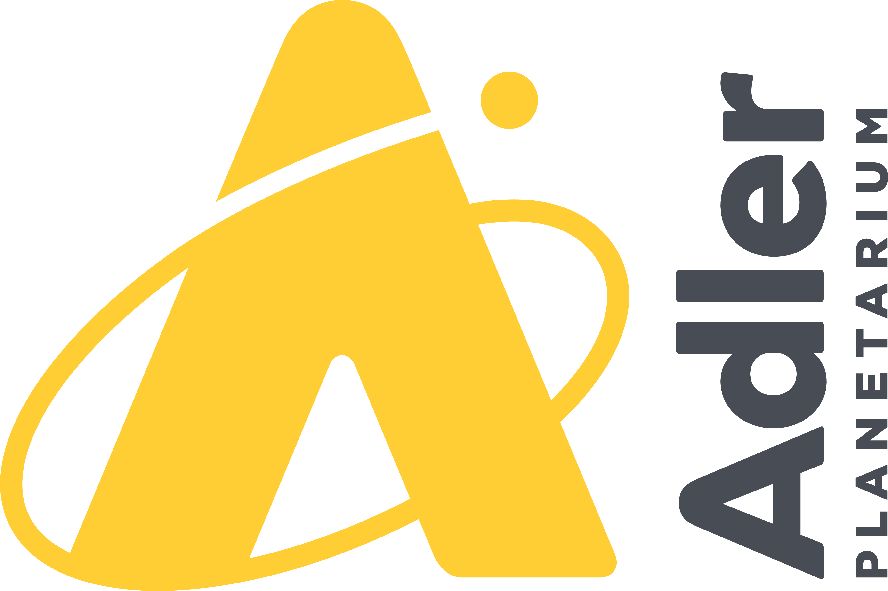

## Lead Institutions

 
 

  
<strong>Northwestern University </strong>

 
 

 
 

  
<strong>University of Illinois Urbana-Champaign </strong>

 
 

 
 

  
<strong>University of Chicago </strong>

 
 

## Partner Institutions

 
 

  
<strong>University of Illinois Chicago </strong>

 
 

 
 

  
<strong>Fermilab </strong>

 
 

 
 

  
<strong>Argonne National Laboratory </strong>

 
 

 
 

  
<strong>Adler Planetarium </strong>

 
 

 
 

  
<strong>Toyota Technological Institute Chicago </strong>

 
 

